# Cashito — La interfaz que le da vida a tus finanzas

Aplicación web SPA moderna de alta fidelidad para la simulación y gestión de créditos vehiculares, construida en **Angular 19** y estilizada de forma premium con **Tailwind CSS**.

---

## Descripción del sistema (Perspectiva del usuario)

**Cashito Frontend** ofrece una experiencia de usuario fluida, interactiva y premium para la asesoría de financiamiento automotriz. Los asesores financieros pueden registrarse, gestionar su cartera de clientes y vehículos, simular cuotas con precisión matemática instantánea, y controlar el ciclo de vida de los créditos. 

### Funcionalidades clave:
- **Autenticación Completa:** Inicio de sesión y registro protegidos. Almacenamiento seguro del token JWT y flujo reactivo mediante guards de Angular.
- **Panel de Control (Dashboard):** Visualización interactiva del portafolio en tiempo real (monto total financiado, clientes activos, créditos vigentes, porcentaje de mora) y listados rápidos de adiciones recientes.
- **Gestión de Clientes:** Altas, bajas, modificaciones y consultas (CRUD completo) de clientes interesados en financiamiento.
- **Catálogo de Vehículos:** Inventario de vehículos con registro de precios y especificaciones.
- **Simulador de Crédito (Motor Financiero Visual):** Formulario avanzado con soporte de variables:
  - Tipo de tasa (TEA/TNA) y frecuencia de capitalización.
  - Porcentaje de cuota balón (restringido automáticamente entre 40% y 50%).
  - Periodos de gracia totales y parciales.
  - Seguro de desgravamen y seguro vehicular mensual.
  - Gastos iniciales (notaría, SOAT, comisión de desembolso, comisión de evaluación).
  - Cálculo inmediato en pantalla de la cuota base, TCEA, VAN (Valor Actual Neto) e TIR (Tasa Interna de Retorno).
  - Tabla dinámica interactiva con el cronograma detallado mes a mes.
- **Historial y Operación de Créditos:** Consulta de créditos guardados, descarga de informes en PDF o Excel, y pasarela interna para que el asesor registre el pago individual de cada cuota de amortización.
- **Portal de Crédito Público:** Vista pública e independiente accesible mediante un enlace con token único. Permite que el cliente final visualice su cronograma, descargue sus reportes en PDF/Excel y apruebe/rechace la oferta de crédito de manera anónima.
- **Configuración de Perfil:** Actualización de información del asesor y cambio seguro de contraseña.
- **Internacionalización (i18n):** Soporte multiidioma dinámico (español/inglés) basado en traducciones JSON a través de `@ngx-translate`.

---

## Tecnologías usadas

- **Framework:** Angular 19.2.0
- **Lenguaje:** TypeScript 5.7.2
- **Diseño y Estilos:** Tailwind CSS 3.4.19 con PostCSS y autoprefixer
- **Componentes de UI:** Angular Material & CDK 19.2.19 (cuadros de diálogo, menús interactivos, tablas optimizadas)
- **Programación Reactiva:** RxJS 7.8.0
- **Iconografía:** Lucide Angular 1.0.0 (iconos vectoriales limpios y minimalistas)
- **Internacionalización:** `@ngx-translate/core` 17.0.0 y `@ngx-translate/http-loader` 16.0.1
- **Utilidades CSS:** `clsx` y `tailwind-merge` para la fusión dinámica de clases

---

## Arquitectura

El frontend está estructurado bajo un diseño modular limpio por capas y características (*features*):

```
src/app/
├── app.routes.ts                       # Rutas globales de la SPA (Públicas, Auth y App Protegida)
├── app.config.ts                       # Configuración de bootstrap (routing, interceptors, i18n providers)
│
├── core/                               # Núcleo global de la aplicación (singleton services)
│   ├── auth/
│   │   ├── guards/                     # auth.guard.ts (protege app/) y guest.guard.ts (protege auth/)
│   │   └── interceptors/               # auth.interceptor.ts (inyecta JWT Bearer) y error.interceptor.ts
│   ├── config/
│   │   └── app.settings.ts             # Configuración central (URL base de la API, tema, idioma por defecto)
│   └── http/
│       └── base.service.ts             # Clase base de servicios con HttpClient inyectado y baseUrl
│
├── layout/                             # Diseños estructurales y componentes de navegación
│   ├── auth-layout/                    # Layout minimalista para login y registro
│   ├── main-layout/                    # Layout principal con navegación responsiva (header y sidebar)
│   ├── header/                         # Barra superior (perfil, notificaciones, selectores)
│   └── sidebar/                        # Menú lateral dinámico de opciones
│
├── features/                           # Módulos del negocio por contexto (Vistas, componentes y lógica)
│   ├── auth/                           # Login, registro y servicio de almacenamiento de tokens
│   ├── clients/                        # CRUD de clientes
│   ├── vehicles/                       # CRUD de catálogo de vehículos
│   ├── simulation/                     # Formulario y cuadrícula de simulación financiera
│   ├── credits/                        # Gestión, estados de créditos, exportación de reportes y pagos
│   ├── public-credits/                 # Portal anónimo de consulta de créditos mediante link público
│   ├── dashboard/                      # Panel principal con KPIs, resúmenes y accesos rápidos
│   └── profile/                        # Actualización de usuario y contraseña
│
└── shared/                             # Componentes, pipes y directivas reutilizables en múltiples features
```

---

## Cómo ejecutar en local

### Requisitos previos
- **Node.js** v20 o v22 (LTS recomendada) instalado.
- **Cashito Backend** levantado y escuchando (por defecto en `http://localhost:5210` o `https://localhost:7115`).

### Pasos para iniciar el frontend:

1. **Clonar el repositorio frontend:**
   ```bash
   git clone https://github.com/tuusuario/cashito-frontend.git
   cd cashito-frontend
   ```

2. **Configurar las variables de entorno:**
   - La URL base por defecto del backend en desarrollo está pre-configurada en `src/app/core/config/app.settings.ts` apuntando a: `http://localhost:5210/api`.
   - Adicionalmente, puede ajustar el archivo `src/environments/environmet.ts` (nota: archivo nombrado `environmet.ts` sin la 'n' final en el proyecto):
     ```typescript
     export const environment = {
       production: false,
       serverBaseUrl: 'http://localhost:5210/api',
     };
     ```

3. **Instalar dependencias del proyecto:**
   ```bash
   npm install
   ```

4. **Levantar el servidor de desarrollo:**
   ```bash
   npm start
   ```
   *Este comando ejecuta `ng serve` bajo el capó.*

5. **Acceder a la aplicación:**
   Abra en su navegador la dirección: `http://localhost:4200`

---

## Vistas principales implementadas

| Vista | Ruta | Descripción |
|-------|------|-------------|
| **Login** | `/auth/login` | Formulario de acceso con validaciones. Almacena el JWT en el storage de la sesión y redirige al dashboard. |
| **Registro** | `/auth/register` | Formulario de registro de nuevos asesores en el sistema. |
| **Dashboard** | `/app/dashboard` | Tablero principal con gráficos informativos y contadores KPI globales (Monto total prestado, tasa de mora, etc.). |
| **Clientes** | `/app/clients` | Listado interactivo de clientes con opción de crear, buscar y actualizar información personal. |
| **Vehículos** | `/app/vehicles` | Catálogo de autos con detalles técnicos y precios de venta base. |
| **Simulador** | `/app/simulation` | Interfaz interactiva para configurar variables financieras, simular en tiempo real y visualizar el cronograma de amortización francés antes de guardar. |
| **Créditos** | `/app/credits` | Bandeja de créditos generados. Permite realizar exportaciones a PDF/Excel, registrar pagos de cuotas y transicionar los estados. |
| **Portal Público** | `/public/credits/:id?token=...` | Portal independiente y público libre de autenticación para que el cliente final revise la propuesta de crédito que le envió el asesor. |
| **Perfil** | `/app/profile` | Página para cambiar la contraseña y datos personales del usuario activo. |

---

## Capturas de pantalla

### Login
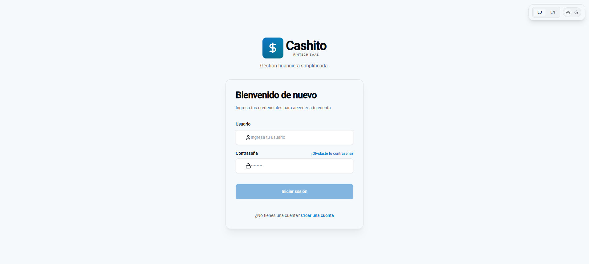

### Registro de Usuario
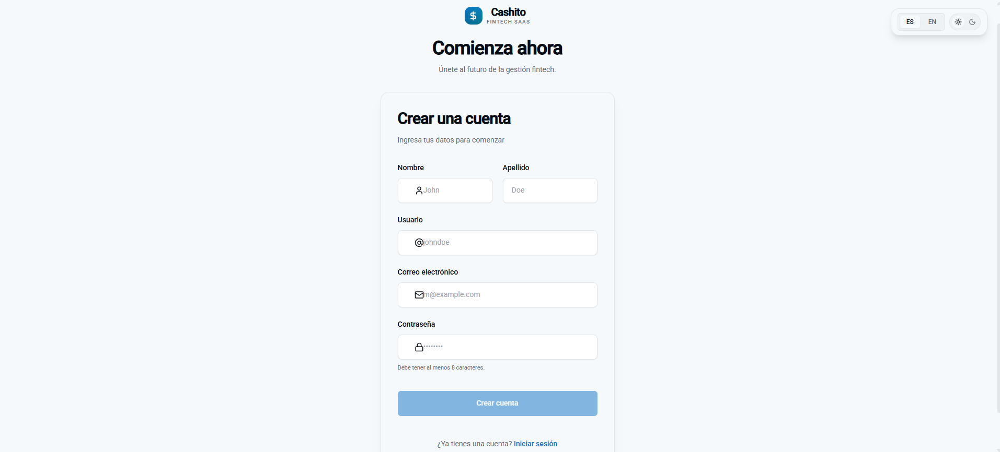

### Dashboard Principal
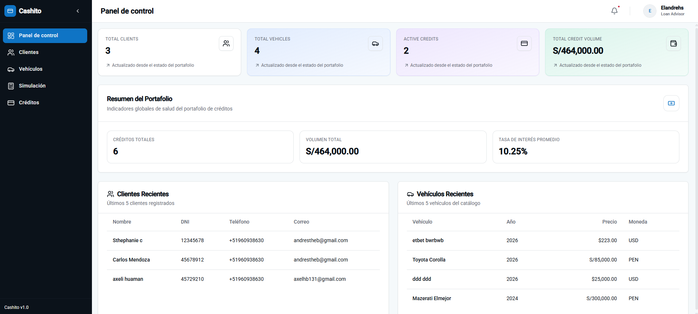

### Clientes
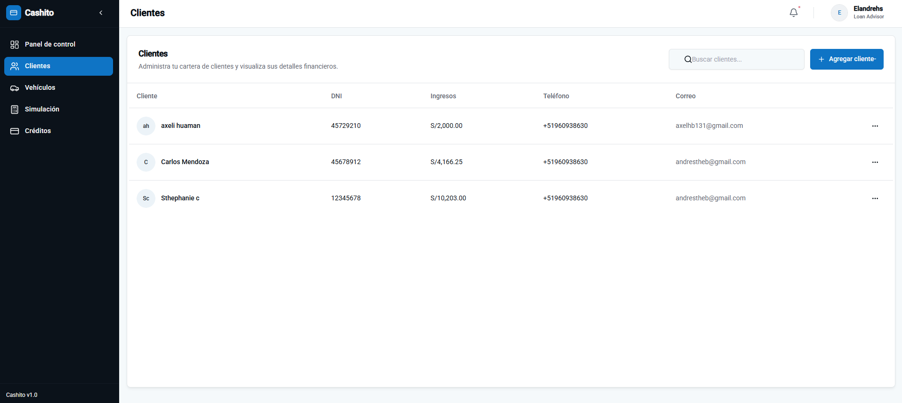

### Form Modal Vehiculos
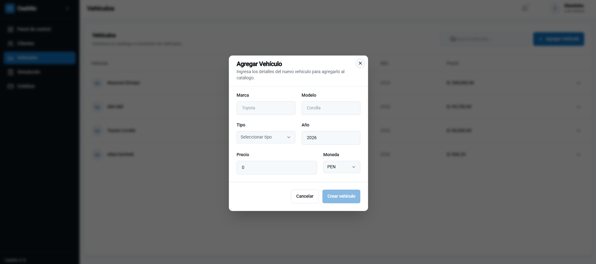

### Simulador de Crédito (Método Francés)
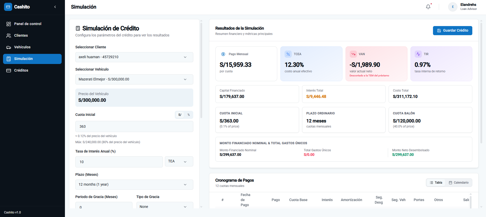

### Detalle de Crédito y Cronograma
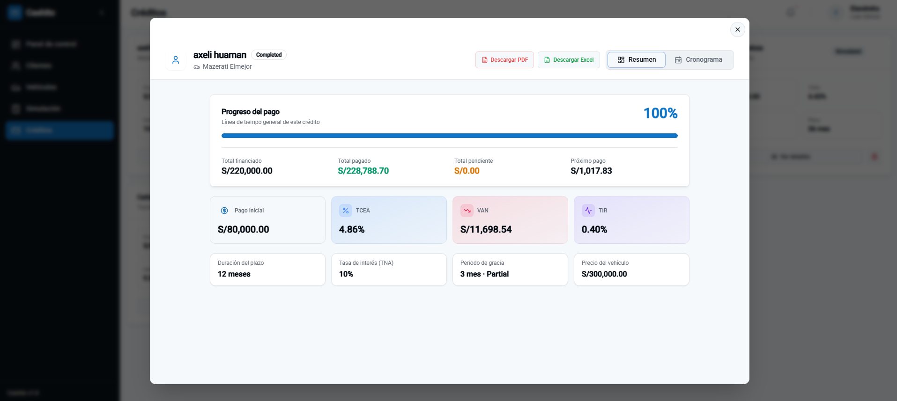
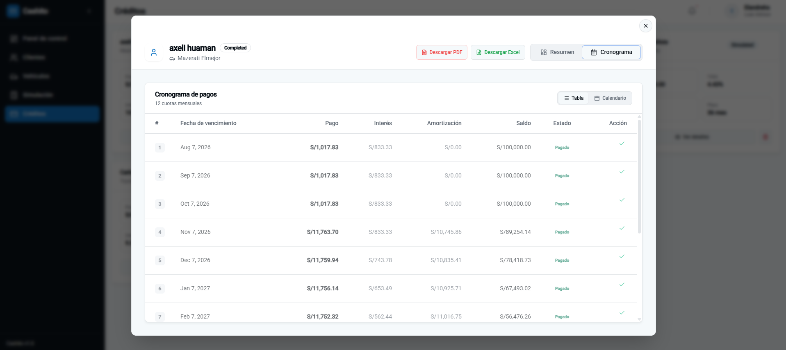
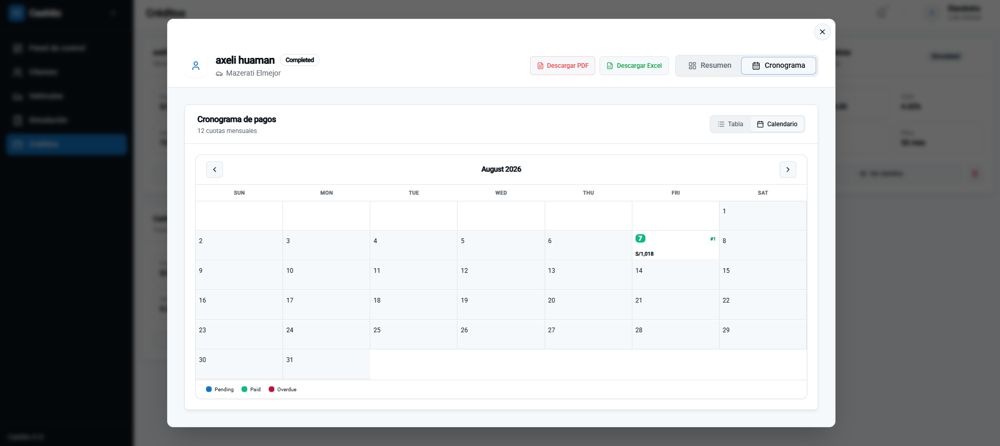

### Portal Público de Crédito (Vista Cliente)
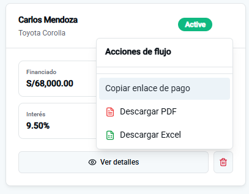
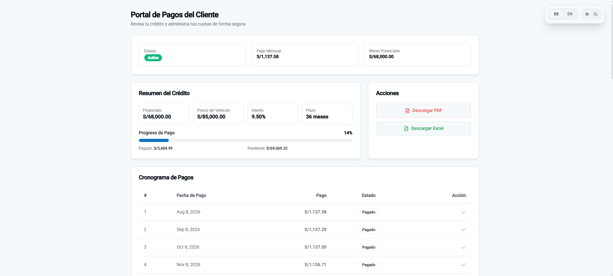

### Notification Via Gmail
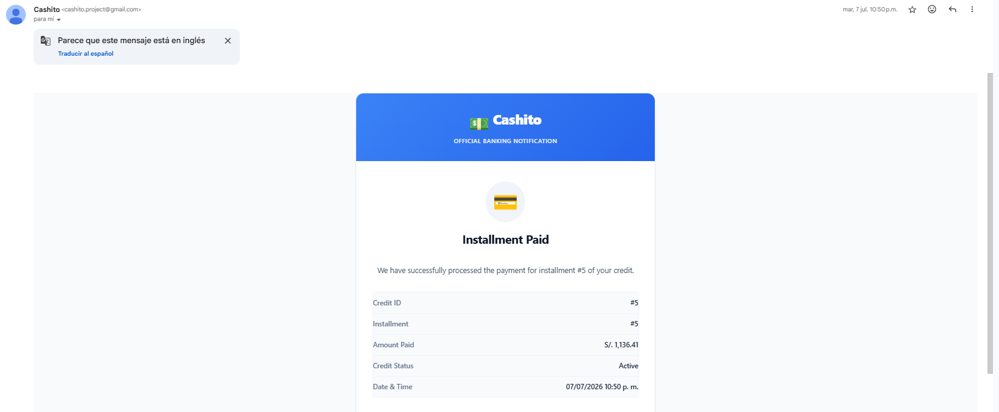

---

## Proyecto relacionado

- [Cashito Backend](https://github.com/tuusuario/cashito-backend) — API REST estructurada en ASP.NET Core y DDD que gestiona la base de datos MySQL y los cálculos del motor financiero.

---

## Autor

**Victor Andres Cruz Ibarra** | **andrestheb@gmail.com** | **+51 960 938 630**

*Cashito Frontend — La interfaz intuitiva y dinámica para simular financiamientos inteligentes sin fricciones.*
